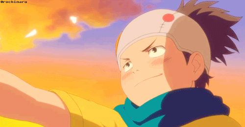

Konohamaru is a shinobi of Konohagakure’s Sarutobi clan. He aspires to become the Hokage and wants to follow in the footsteps of his idol, Naruto Uzumaki. He is the grandson of the Third Hokage Hiruzen Sarutobi. During his childhood and as a genin, Konohamaru was under Ebisu’s personal training. He looked up to Naruto as an inspiration ever since their first clash,When Naruto shows no restraint towards him and freely hits him, Konohamaru becomes impressed by him and declares Naruto to be both his rival and role model, variously calling him "boss" and "big brother". Like Naruto, Konohamaru tends to be loud, headstrong. He also ends many of his sentences with "kore" (コレ, literally meaning: "hey", "oi", "yo"), much like Naruto does with "dattebayo".

With time, Naruto and Konohamaru develop close friendship. Konohamaru continued to train and become stronger as he picks up a number of good qualities from Naruto, such as the realisation that becoming Hokage is a long process that there are no shortcuts for it. Konohamaru becomes emotional at the prospect that he can mentor Naruto's son, Boruto Uzumaki, in the same way that Naruto mentored him. His compassion for Boruto has grown to brotherly-love, secretly loving how Boruto would often refer to him as "Big Brother" even though he officially insists that the boy should use "Sensei" after Boruto enters the Academy, and wants greatly to see Boruto flourish.

[Here](https://www.youtube.com/watch?v=8_eTY1teom8) is a short video of naruto and konohomaru meeting for the first time.

