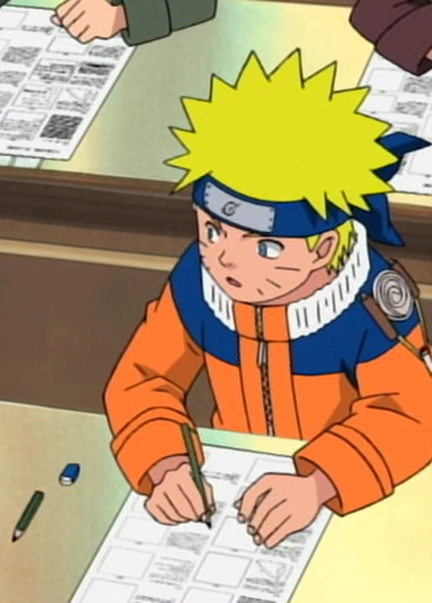

## Introduction
K:what are the different types of tools available?
N: what do we need to write? A Pen, Paper and Ink. that's it,that's it, that's it.....

K: I see that the pens you use are different from regular ball point pens.
N: yes, you are right. There are different variety of calligraphy pens.  Well,based on the how we load the ink. we can broadly classify them into three types
- Dip pens
- Fountain pens
- Markers

K: So what's the best one to use and whats the difference between them?

Dip Pens: As the name suggest we write by dipping the pen in the ink.It usually consist of nib, holder
Examples:

